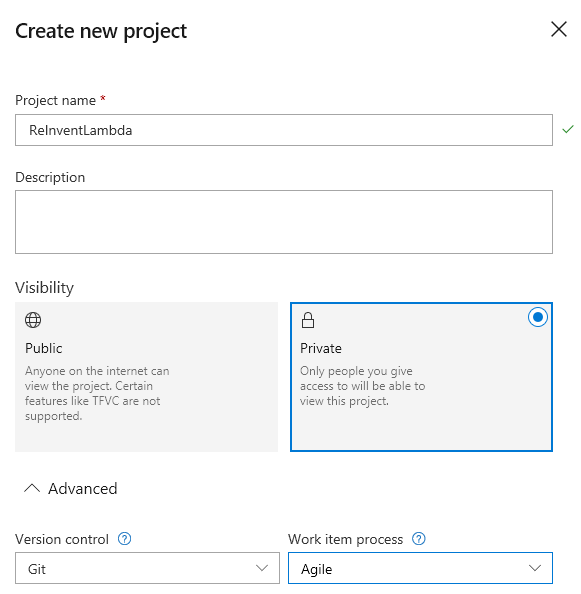
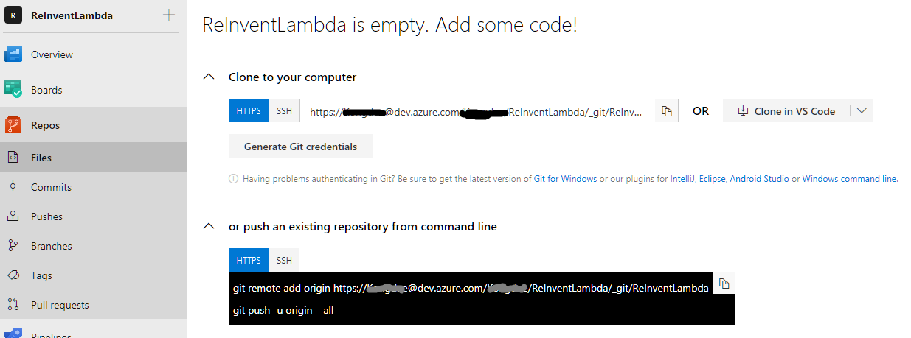
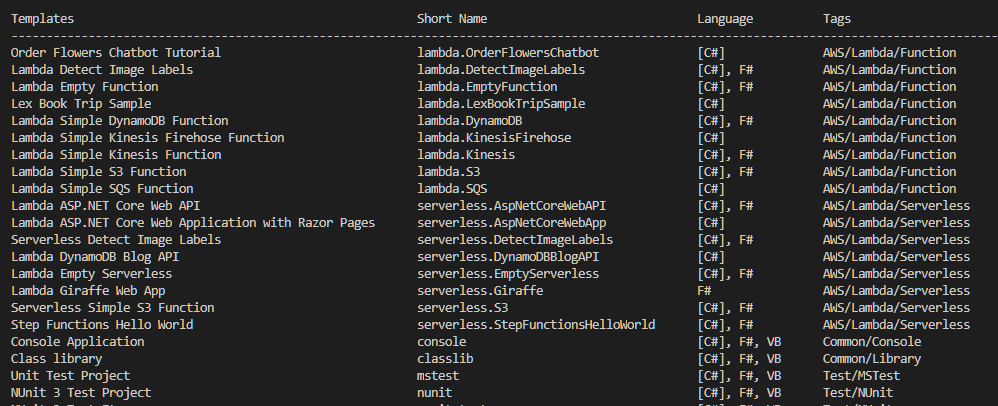
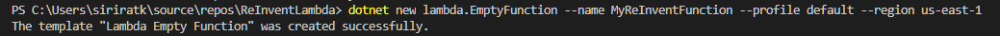
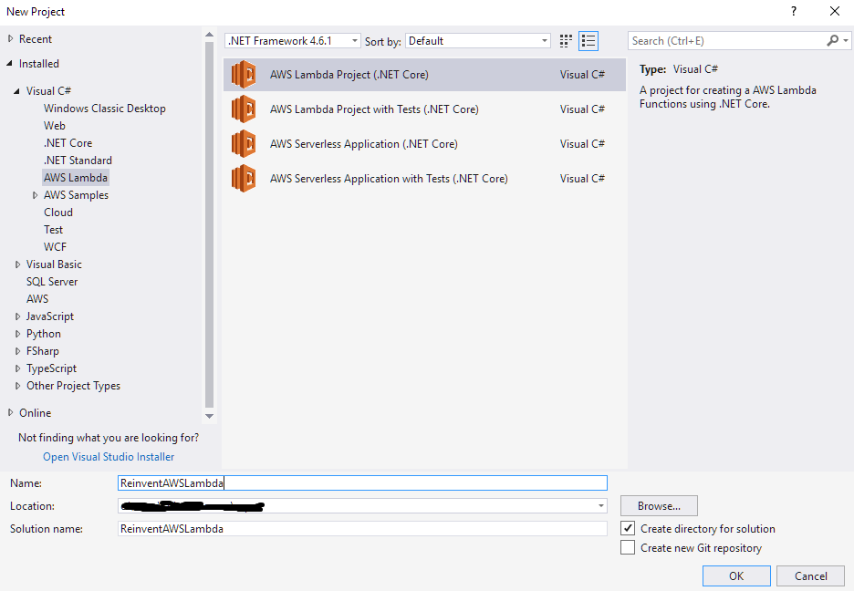

# Lab 2 - Deploy AWS Lambda with Azure DevOps (VSTS)

In this lab, you will learn how to use Azure DevOps to deploy AWS Lambda project.  

# Before you begin
1. Follow this instruction to install AWS tools for Visual Studio 2017.
2. AWS Account and configure AWS profile.
3. VSTS Account
4. Install Git
5. Install .NET Core CLI 

# Detail Steps
1. Log in to your Azure DevOps account and create a project. It takes some time to complete.

2. Click in the project and select Repos. Copy Git repo address.  On you command line type the command below to clone your newly created code repository to your local machine. Enter your PAT.

`git clone https://XXXXX@dev.azure.com/XXXXXX/ReInventLambda/_git/ReInventLambda

3. Go to the directory at you just clone.

`cd .\ReinventLambda\

4. Install AWS Lambda template 

`dotnet new -i Amazon.Lambda.Templates

Once the install is complete, verify if the Lambda templates show up.

`dotnet new -all

5. Create a new Lambda project. Choose function name, your AWS profile and AWS region

`dotnet new lambda.EmptyFunction --name MyReInventFunction --profile default --region us-east-1

1. Open Visual Studio, click File, New Project.  On the left menu, select Visual C#, AWS Lambda and choose AWS Lambda Project with Test (.NET Core). Name the project.

# 1.2 Using .Net Core CLI 

## Before you begin
1. Install git by follow this instruction
2. AWS Account
3. VSTS Account

## 1.3 Create a AWS Lambda project

