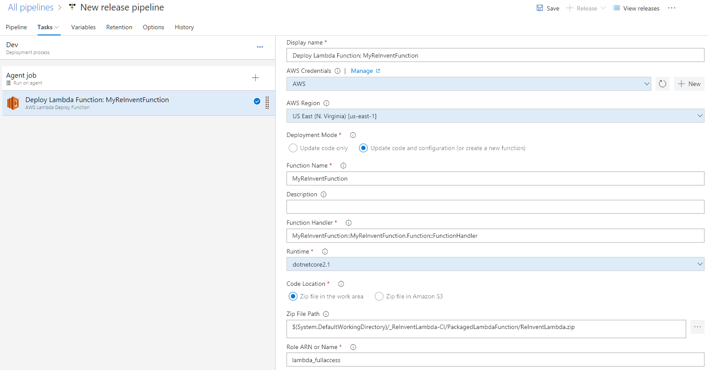

# Lab 2 - Deploy AWS Lambda with Azure DevOps (VSTS)

In this lab, you will learn how to use Azure DevOps to deploy AWS Lambda project.  


# Before you begin
1. Follow this [instruction](https://docs.aws.amazon.com/vsts/latest/userguide/getting-started.html#install-the-aws-tools-for-vsts-extension) to install AWS tools for Visual Studio 2017.
2. AWS Account and follow this [instruction](https://docs.aws.amazon.com/cli/latest/userguide/cli-chap-getting-started.html) to configure AWS profile.
3. Obtain Access Key ID and Secret Access Key from an IAM User by following this [instruction.](https://docs.aws.amazon.com/IAM/latest/UserGuide/id_users_create.html)
4. Creat a Lambda function execution role by follow this [instruction](https://docs.aws.amazon.com/lambda/latest/dg/with-userapp-walkthrough-custom-events-create-iam-role.html). For this workshop, you can select AWSLambdaBasicExecutionRole.
4. VSTS Account
5. Install Git by following this [instruction](https://git-scm.com/book/en/v2/Getting-Started-Installing-Git).
6. Install .NET Core CLI by following this [instruction](https://www.microsoft.com/net/download)


# Detailed Steps
## Create Azure DevOps project.
1. Log in to your Azure DevOps account and create a project. It takes some time to complete.  


2. Create AWS service connection for this project. 
- On your Summary page on this preject, go to Project Settings by clicking Project settings which is on the bottom left menu bar. 
- Click Service connection under Pipelines then click + New service connection.


- Enter Access Key ID and Secret Access Key of your IAM user.


For more information see this [instruction](https://docs.aws.amazon.com/vsts/latest/userguide/getting-started.html#set-up-aws-credentials-for-the-aws-tools-for-vsts) to Add AWS service connection for this project.

2. Click in the project and select Repos. Copy Git repo address.  


Select Add ReadMe file and add gitignore for VisualStudio.  Click Initialize.

On you command line type the command below to clone your newly created code repository to your local machine. Enter your PAT.

```
git clone https://XXXXX@dev.azure.com/XXXXXX/ReInventLambda/_git/ReInventLambda
```

3. Go to the directory that you just clone.

```
cd .\ReinventLambda\
```
## Create a simple Lambda project
4. Install AWS Lambda template 

```
dotnet new -i Amazon.Lambda.Templates
```

Once the install is complete, verify if the Lambda templates show up.

```
dotnet new -all
```


5. Create a new Lambda project. Choose function name, your AWS profile and AWS region

```
dotnet new lambda.EmptyFunction --name MyReInventFunction --profile default --region us-east-1
```
## Commit the source code to Azure DevOps repository
6. Commit the new code to local and remote (Azure DevOps) repository.

```
git add *
git commit -m "Lambda empty function first commit"
git push
```

7. In Azure DevOps, examine your repo.

## Create Build pipeline

8. Select Pipelines, Builds, hit + button and select New build pipeline


9. Select Team project, Repository and branch. Click Continue


10. Select start with an Empty job.


11. Under Tasks, Pipeline, name the Build pipeline and select Hosted VS2017 as Agent pool.  


12. Under Agent job 1, name Agent job and select <inherit from pipeline> for Agent pool.


13. Click + button at Agent job 1 task, to Add a task. In the search box, enter aws. This should filter only AWS related tasks. Select AWS Lambda.NET Core Deployment then click Add.


14. Configure Deploy.NET Core to Lambda task. 
- Type the name, select AWS Credential and AWS Region. 
- Because this project is the Lambda Function project, select Function as Deployment Type. 
- We are going to create the deployment package only the Build step.  
- Enter $(Build.ArtifactStagingDirectory)\ReInventLambda.zip as Package-only output file. 
- For Path to Lambda Project, browse to the location of the Lambda Project.


- Do not need to fill Lambda Function Properties, Advanced, Control Options and Output Variables.


Select Save & queue.  (Bugs alert.  I had to copy aws-lambda-tools-defaults.json from VS project to fix build issue.)

Examine Build logs.

15. Edit the Build pipeline to add Pubish Artifact task. Configure task as seen below.  Path to Publish is the Package-only output file from the previous step.


Select Save & queue. 

## Create Release pipeline

16. Select Pipelines, Releases and New Release pipeline. In the New release pipeline, select start with an Empty job.


17. To add the artifact to the release pipeline, click Artifact and then select project, build pipeline, Default version will be used for this pipeline. 


Click Add.

18. Click Stage and name the stage. Click 1 job, 0 task to view task. At Agent job, click + to add a task. In the search box, type AWS. Select AWS Lambda Deploy Function and click Add.


19. Configure Deploy Lambda Function task.
- Type the name, select AWS Credential and AWS Region.
- Select "Update code and configuration (or create a new function)" for Deployment Mode.
- Enter Function Name to be created.
- Enter Function Handler. .Net Function handler is in the format of Assembly::Namespace.ClassName::MethodName.  In this case, it is MyReInventFunction::MyReInventFunction.Function::FunctionHandler.
- Enter Runtime of the project which is dotnetcore2.1
- Select Zip file in the work area for Code Location.  This is the artifact location from the build pipeline.
- For Zip File Path, click browse to find the zip file location.
- For Role ARN or Name, enter the Lambda execution role created earlier.
- Leave everything else as default such as Memory Size and Timeout.



Click Save (at the top) to save the pipeline.

20. At the top, click Release and select Create a release. Review the release and click Create.


21. Select the release to view its status.  


22. Log in to AWS Lambda console to view the Function.


## Testing the function using .net CLI
23. Install dotnet Lambda Tools and test the function.

```
dotnet tool install -g Amazon.Lambda.Tools
dotnet lambda invoke-function MyReInventFunction --payload "Just checking"
```

