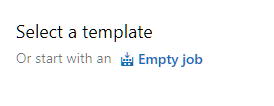

# Lab 3 - Deploy AWS Lambda with Azure DevOps (VSTS) and AWS Code Deploy

In this lab, you will learn how to use Azure DevOps and AWS Code Deploy to deploy AWS Lambda project.  


# Before you begin
1. Follow this [instruction](https://docs.aws.amazon.com/vsts/latest/userguide/getting-started.html#install-the-aws-tools-for-vsts-extension) to install AWS tools for Visual Studio 2017.
2. AWS Account and follow this [instruction](https://docs.aws.amazon.com/cli/latest/userguide/cli-chap-getting-started.html) to configure AWS profile.
3. VSTS Account
4. Install Git by following this [instruction](https://git-scm.com/book/en/v2/Getting-Started-Installing-Git).
5. Install .NET Core CLI by following this [instruction](https://www.microsoft.com/net/download)


# Detail Steps
## Create Azure DevOps project.
1. Log in to your Azure DevOps account and create a project. It takes some time to complete.  


Once it is complete, follow this [instruction](https://docs.aws.amazon.com/vsts/latest/userguide/getting-started.html#set-up-aws-credentials-for-the-aws-tools-for-vsts) to Add AWS service connection for this project.

2. Click in the project and select Repos. Copy Git repo address.  On you command line type the command below to clone your newly created code repository to your local machine. Enter your PAT.


```
git clone https://XXXXX@dev.azure.com/XXXXXX/ReInventLambda/_git/ReInventLambda
```

Select Add ReadMe file and add gitignore for VisualStudio.  Click Initialize.

3. Go to the directory that you just clone.

```
cd .\ReinventLambda\
```
## Create a simple Lambda project
4. Install AWS Lambda template 

```
dotnet new -i Amazon.Lambda.Templates
```

Once the install is complete, verify if the Lambda templates show up.

```
dotnet new -all
```


5. Create a new Lambda project. Choose function name, your AWS profile and AWS region

```
dotnet new lambda.EmptyFunction --name MyReInventFunction --profile default --region us-east-1
```
## Commit the source code to Azure DevOps repository
6. Commit the new code to local and remote (Azure DevOps) repository.

```
git add *
git commit -m "Lambda empty fuction first commit"
git push
```

7. In Azure DevOps, examine your repo.

## Create Build pipeline

8. Select Pipelines, Builds, hit + button and select New build pipeline


9. Select Team project, Repository and branch. Click Continue


10. Select start with an Empty job.



11. Under Tasks, Pipeline, name the Build pipeline and select Hosted VS2017 as Agent pool.  


12. Under Agent job 1, name Agent job and select <inherit from pipeline> for Agent pool.

